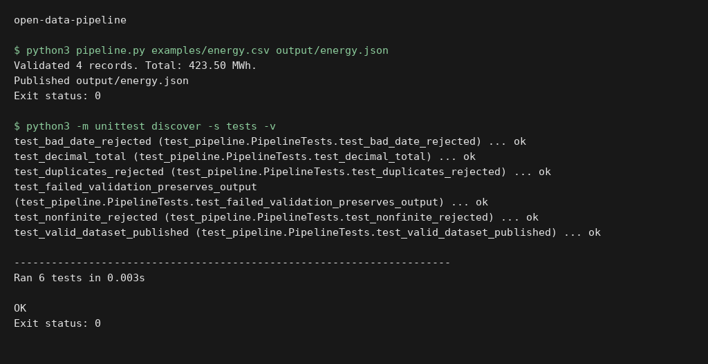

# Open data pipeline

Validate regional energy CSV files before publishing a deterministic JSON dataset. The pipeline checks columns, dates, duplicate keys and finite nonnegative values; Decimal arithmetic preserves totals. Output replacement is atomic, so validation failures leave the previous dataset intact.

```sh
python pipeline.py examples/energy.csv output/energy.json
python -m unittest discover -s tests -v
```

The included four-row dataset is synthetic. This repository does not fetch a live public feed or claim to report actual regional consumption. The current implementation supports up to 100,000 records per file.

## Execution preview



Local execution of `python3 pipeline.py examples/energy.csv output/energy.json`. The input and output shown come from the repository example or test fixtures. [Verification](docs/verification.md).

